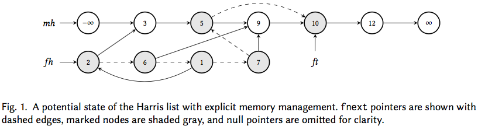

# Harris' non-blocking concurrent linked list

## Description of the algorithm

[Harris](https://doi.org/10.1007/3-540-45414-4_21) gives a concurrent non-blocking algorithm that implements a set data structure as a sorted list, and uses atomic compare-and-swap (CAS) operations to allow a high degree of parallelism.
As with the sequential linked list, Harris' algorithm inserts a new key `k` into the list by finding nodes `k1, k2` such that `k1 < k < k2`, setting `k` to point to `k2`, and using a CAS to change `k1` to point to `k` only if it was still pointing to `k2`.
However, a similar approach fails for the delete operation.
If we had consecutive nodes `k1, k2, k3` and we wanted to delete `k2` from the list (say by setting `k1` to point to `k3`), there is no way to ensure with a single CAS that `k2` and `k3` are also still adjacent (another thread could have inserted or deleted in between them).

Harris' solution is a two step deletion: first atomically mark `k2` as deleted (by setting a mark bit on its successor field) and then later remove it from the list using a single CAS.
After a node is marked, no thread can insert or delete to its right, hence a thread that wanted to insert `k'` to the right of `k2` would first remove `k2` from the list and then insert `k'` as the successor of `k1`.

Things get complicated when we want to free deleted nodes.
Since marked nodes can still be traversed by other threads, there may still be suspended threads accessing a marked node even after we remove it from the list.
Thus, we cannot free the node immediately.
A common solution is the so-called drain technique which maintains a second "free list'' to which marked nodes are added before they are unlinked from the main list.
These nodes are then labeled with a timestamp indicating when they were unlinked.
When the starting timestamp of all active threads is greater than the timestamp of a node in the free list, the node can be safely freed.
This leads to the kind of data structure shown in Fig. 1, where each node has two pointer fields: a `next` field for the main list and an `fnext` field for the free list (shown as dashed edges).
Threads that have been suspended while holding a reference to a node that was added to the free list can simply continue traversing the `next` pointers to find their way back to the unmarked nodes of the main list.

## Challenge 1: sequential memory safety

The simplest challenge is to verify that the Harris list is memory safe and not leaking memory when executed in a sequential setting.
A proof of this will likely rely on the following invariants:

* The data structure consists of two (potentially overlapping) lists: a list on `next` edges beginning at `mh` and one on `fnext` edges beginning at `fh`.
* The two lists are null terminated and `ft` is an element in the free list.
* The `next` edges from nodes in the free list point to nodes in the free list or main list.
* All nodes in the free list are marked.
* Unmarked nodes in the main list are sorted, with `mh` having data value `-infinity` and the tail node having `infinity`.

Here are some reasons why this is a challenging verification problem:

* As the main and free lists may overlap arbitrarily, it is hard to describe the structure by using a separating conjunction of two inductively-defined seperation logic linked-list predicates, each using a different successor field.
* For the same reason, we can also not describe the entire structure with a single inductive predicate that uses separating conjunction because the predicate must describe each node exactly once.
Here, we could have arbitrarily many nodes in the free list with `next` edges to the same node in the main list (imagine a series of successive deletions of the predecessor of a node, such as `6, 7, 5` in Fig. 1).
Because of this, it is not easy to describe the list nodes using separating conjunction as there is no way of telling if we are "double-counting'' them.
* Also, using an inductive list predicate to describe the main list would work well only for reasoning about traversals starting from `mh`, since that is the only possible unrolling of the predicate.
By contrast, threads may enter the main list at arbitrary points in the list by following `next` edges from the free list.
* To further complicate matters, the `next` edges of free list nodes can even point backward to predecessors in the free list (for e.g. `1` points back to `2` in Fig. 1, creating a cycle).
* Finally, coarse abstractions, such as using an iterated separating conjunction might not be able to capture key inductive invariants, such as that every node must be reachable from `mh` or `fh`, which are critical for proving the absence of memory leaks.

### A solution sketch

One solution is to use [Flow Interfaces](https://doi.org/10.1145/3158125), a permission-based abstraction mechanism for unbounded heap regions that allows one to reason about inductive graph properties in a local manner.
The [POPL 2018 paper](https://doi.org/10.1145/3158125) introducing flow interfaces also describes how to encode the above invariants using flows, and provides a (paper) proof of the insert procedure in a modified concurrent separation logic.

## Challenge 2: concurrent memory safety

## Challenge 2.5: concurrent memory safety, including timestep-based freeing of marked nodes

## Challenge 3: full functional correctness in concurrent setting

## More Information

* [Harris' original paper](https://doi.org/10.1007/3-540-45414-4_21)
* [Flow Interfaces paper](https://doi.org/10.1145/3158125)
* Contact person: [Siddharth Krishna](https://cs.nyu.edu/~siddharth/)
